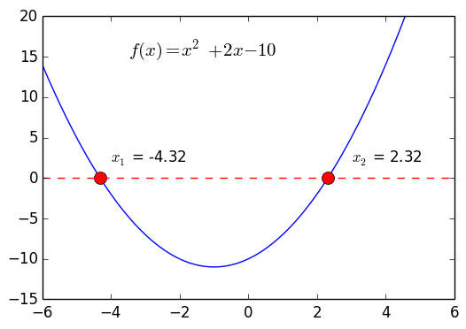

# Nulpunten

Schrijf een programma dat de nulpunten berekent van de polynoom $$f(x)=x^2+2x-10$$ en de grafiek van de functie plot.

	# python nulpunten.py
	De nulpunten zijn -4.32 en 2.32

## Specificatie

- Schrijf een functie `nulpunten(a, b, c)` die de nulpunten van de polynoom $$f(x)=ax^2+bx+c$$ berekent.

- Bereken de nulpunten met behulp van de abc-formule.

- Er zijn twee mogelijkheden voor het resultaat van de functie:

	- een lege lijst `[]` als er geen nulpunten zijn
	- een lijst met twee elementen `[n1, n2]` waarin `n1` en `n2` de nulpunten van de polynoom zijn

## Hoe te beginnen

1. Maak een bestand `nulpunten.py` aan.

2. Schrijf hierin een functie `nulpunten(a, b, c)`.

3. Voeg onder de functie-definitie je eigen test toe:

		resultaat = nulpunten(1, 2, -10)

4. Plot daaronder de functie met daarin de nulpunten uit de berekening duidelijk aangegeven.

5. Test ook met een polynoom die geen nulpunten heeft (check of de lijst leeg is). Het programma moet dan wel de functie plotten, maar ook netjes printen dat de nulpunten ontbreken:

        Deze functie heeft geen nulpunten

## Testen

	checkpy nulpunten.py

(Werkt het niet? Update dan nog eens met `checkpy -u`.)
