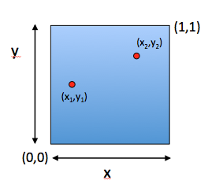

# Afstand

Schrijf een programma met een daarin een functie die de gemiddelde afstand tussen twee punten in een vierkant met afmeting $$1xx1$$ berekent.

## Achtergrond

Dit is een typisch voorbeeld van een duidelijk en ogenschijnlijk simpel probleem dat analytisch nogal lastig op te lossen is. Probeer het maar eens, dan zal je al snel zien dat je vastloopt.

Net zoals je bij een "gewone" natuurkunde- of wiskundeopdracht is het belangrijk om vooraf een schatting te maken van de uitkomst zodat je een verkeerd antwoord meteen herkent. Wat denk je dat het antwoord moet zijn ? Als je programma klaar is kan je ook heel makkelijk de gemiddelde afstand in een vierkant van $$2xx2$$ uitrekenen. Wat denk je ? Is dat 'gewoon' 2 keer zo groot als je antwoord bij het $$1xx1$$-vierkant .... of is het misschien $$x^2$$ keer zo groot ... of juist $$\sqrt{2}$$ ? 

## Specificatie

- De naam van het programma is `afstand.py`.

- Definieer daarin een functie `vierkant()` die geen parameters accepteert en de gemiddelde afstand tussen twee punten in zo'n vierkant `return`t.

## Probleemanalyse

- Genereer steeds twee random punten: dus twee random $$x$$-waardes en twee random $$y$$-waardes, en bereken de afstand tussen de punten

- Doe dit bovenstaande een groot aantal keer ($$N$$) en hou in een aparte variabele de totale afstand bij.

- Bereken de gemiddelde afstand door de totale afstand te delen door $$N$$.

## Testen

	checkpy afstand.py
