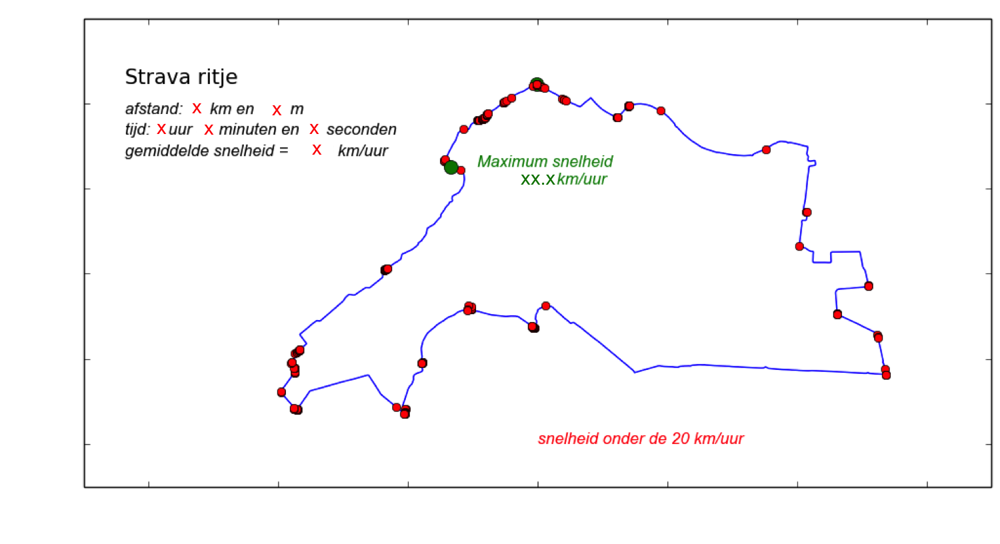
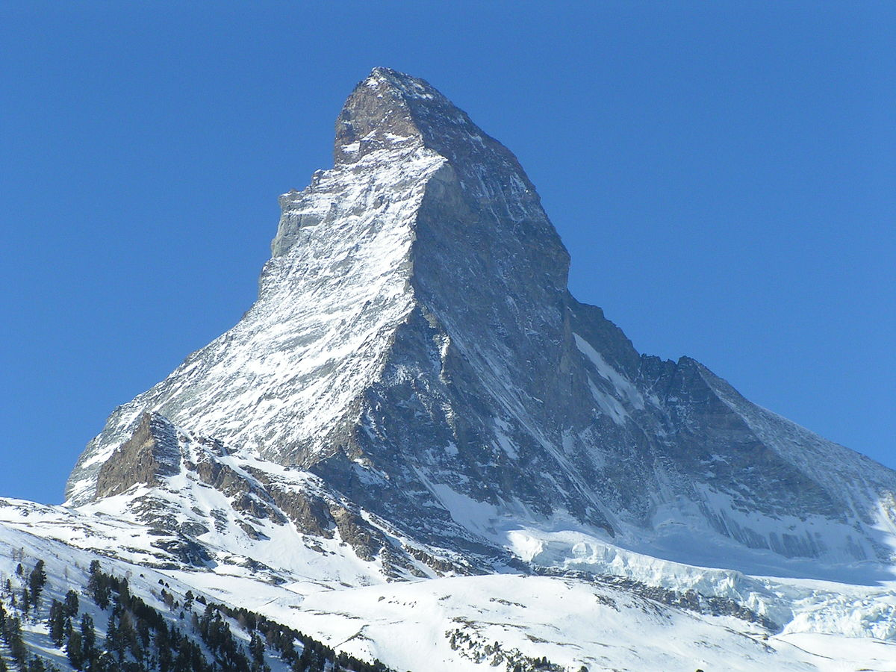

# Opdracht: Sensordata verwerken  

{:.inline}{: style="width:8%"}

Een mobiele telefoon bevat enorm nauwkeurige sensoren om grootheden als positie, snelheid, versnelling etc vast te leggen. Naast navigatie wordt dit ook toegepast in allerlei apps die voor sporten worden gebruikt. In deze opgave gaan we aan de slag met de data die verzameld wordt in de app die door de meeste wielrenners gebruikt wordt: Strava. Na de rit kan je in de app allerlei gegevens over je rit terugkijken: de projectie van de route op een interactieve kaart, de gemiddelde snelheid, het hoogteprofiel, records op kleine stukken etc etc. We gaan in deze opgave een paar van deze dingen namaken en, niet verder vertellen, een deel van de data manipuleren: digitale doping.

Onze data-set is een fietsrit die een natuurkundige aan de universiteit van Amsterdam maakte in de buurt van Leiden samen met zijn buurman. De data-file zoals die door de app gebruikt wordt is hier te downloaden: [FietsRitData.gpx](FietsRitData.gpx).

De eerste regels van de file bevatten wat tekst, maar daarna wordt het interessant. Er worden (ongeveer) elke seconde drie zaken vastgelegd: positie, hoogte (elevation) en de tijd. Dit is genoeg informatie om de rest te berekenen. In het plaatje hiernaast zie je een kleine preview van de eerste drie metingen die in de file te vinden zijn:

{: style="width:40%"}

Als je goed kijkt zie je dat elk data-punt/meting bestaat in drie regels wordt weggeschreven:

	1) positie in lengte- en breedtegraad 
	2) de hoogte
	3) de datum en tijd

We gaan stap voor stap een programma **Strava.py** schrijven dat de volledige file doorloopt, de metingen uit de file decodeert en in afzonderlijke lijsten opslaat. We doen dat aan de hand van de onderstaande opdrachten.

## Opdracht 1: teken de route op het scherm

Maak een functie **Fietsrit()** die de file opent, alle metingen doorloopt en voor elk punt de positie bijhoudt in twee afzonderlijke lijsten: de latitude en de longitude. Maak aan het eind  een grafiek van de meetpunten. Orienteer het zo dat het op een kaart van Google maps geprojecteerd zou kunnen worden, dus het noorden netjes in het noorden etc.

Schrijf een programma **Strava.py** dat de volledige file doorloopt, de x-positie en y-positie van elke meting in twee afzonderlijke lijsten opslaat en er een grafiek van maakt op het scherm. Geef het beginpunt aan met een grote groene stip en het eindpunt met een kleine rode. 

Verderop in de opgave gaan we nog wat extra informatie toevoegen op het scherm. Hou dus iets ruimte over bij het tekenen van de grafiek.  Randen grafiek:
	 longitude tussen 4.325 en 4.675
	 latitude tussen 52.05 en 52.16

### Computing tips:

Tijdens het inlezen van elke regel kan je een test uitvoeren of er een bepaalde string in de regel voorkomt. Als je de file bekijkt zie je dat je de regel met de positie kan herkennen door de lettervolgorde *<trkpt*. Zodra je de regel 'herkend' hebt moet je natuurlijk zelf op de juiste manier de posities herkennen om de

       if "<trkpt" in line: 
           latitude = ....
           longitude = ....

*Let op:* zodra je het stukje regel hebt herkent waar de latitude is opgeslagen herkent de computer dit nog steeds al tekst en niet als getal. Gebruik de functie float() om dat stukje van de regel ook echt om te zetten in een getal voor je het opslaat in de lijst. Zo kan je er verderop in het programma ook mee rekenen.

## Opdracht 2: totaal afgelegde afstand en snelheidsgrafiek

Maak een grafiek van de snelheid als functie van de tijd, waarbij de tijd weergegeven is als aantal seconden na het begin van de rit. Geef ook in de grafiek duidelijk aan wat de maximale snelheid was: groene stip op het juiste tijdstip op de plek van de hoogste snelheid. Laat je programma ook deze grootheden printen.

	Rit: de totale duur van de rit was x uur, y minuten en z seconden
	Rit: de totaal afgelegde weg was x.x km
	Rit: de gemiddelde snelheid was xx.x km/uur
	Rit: de maximum snelheid was xx.x km/uur en werd gereden x seconden na de start van de rit
        
### Stappenplan:

	- stap 1: maak de lijst met meettijden (in seconden na het begin van de rit)

Als je de regel met de tijdstippen hebt gedecodeerd (uur, minuten en seconden) is het handig om die om te rekenen naar een aantal seconden sinds het begin van de dag. Dit maakt het daarna eenvoudig om het verschil tussen verschillende meetmomenten te berekenen. En om het helemaal makkelijk te maken kan je zodra je het eerste meetmoment hebt gevonden dat definieren als t=0. Elk meetpunt kan je daarna uitrekenen als verlopen tijd ten opzichte van dat tijdstip en dat zo in de lijst opslaan.

    - stap 2: maak de lijst met snelheden 

Zodra je vanuit de datafile alle posities en tijden hebt ingelezen kan je de file sluiten. Je hebt dan alle informatie die je nodig hebt en kan de 'afgeleide' informatie zelf uitrekenen. Wij gaan bijvoorbeeld de totale afgelegde weg en de lijst met snelheden op elk tijdstip uitrekenen. Als we bij meetpunt *i* zijn aangekomen weten we zowel de afgelegde weg (verschil tussen de twee posities) als het tijdsverschil en kunnen zo de snelheid op dit kleine interval berekenen. Sla de snelheden op elk meetpunt op in een lijst.

*Let op:* we nemen aan dat de fietser stilstond op t=0, dus het eerste element in de lijst met snelheden is 0.

    - stap 3: de lijst met afgelegde afstanden

Tijdens het (opnieuw) doorlopen van de lijsten om de snelheidslijst te vullen kan je nu ook de totale (tot nu toe) afgelegde weg bijhouden in een lijst. Ook deze list begint met 0 op t=0.

        
## Opdracht 3: afgelegde route met extra informatie

Teken opnieuw de grafiek van de afgelegde route (net als in opdracht 1), maar voeg nu wat extra elementen toe:

	- rit-karakteristieken (duur, afgelegde weg en gemiddelde snelheid) als tekst in de grafiek
	- groene stip waar de maximale snelheid werd behaald. Snelheid ook in groene tekst in buurt van de stip
	- rode bolletjes waar de snelheid lager was dan 20 km/uur

{:.inline}{: style="width:80%"}

Laat je programma ook berekenen hoe lang er onder de 20 kilometer per uur gereden is. Print dus: 

	Er is gedurende x seconden langzamer gereden dan 20 km/uur
	
## Opdracht 4: Nederlandse col van de buitencategorie

{:.inline}{: style="width:40%"}

Oud wielrenner Thijs Zonneveld lanceerde een paar jaar geleden het idee om een berg in Nederland te plaatsen. Geen grap hè, kijk maar: 

Nou zal dat geen Mount Everest worden, maar we dromen groot en houden van hoge klimpercentages dus laten we eens aannemen dat we de Matterhorn (4478 m) gaan nabouwen in het groene hart. Om te kijken hoe dat er op een Strava profiel uit zou zien en om een psychologische edge op zijn buurman te krijgen besluit de natuurkundige de data zo te faken dat het lijkt of hij al een berg zo hoog als de Matterhorn heeft geklommen tijdens dit zondagse ritje.

### Opdracht 4a: teken het echte hoogteprofiel van de rit

Naast de locatie en de tijd is ook de hoogte opgeslagen op elk meetpunt. Sla ook die data op in een lijst en teken de grafiek van de hoogte als functie van de tijd (weer in seconden sinds het begin van de rit). 

*Let op:* het kan erg verleidelijk zijn om op basis van de eerste paar regels te concluderen dat de hoogte is opgeslagen in een korte (3 karakters, nl X.Y) en dat te zien als X meter en Y decimeter boven zeeniveau. Nou klopt het dat je rond Leiden nooit boven de tien meter uitkomt, maar als je in de bergen gaat fietsen moet je er rekening mee houden dat het weergeven van de hoogte ruimte inneemt. Hoewel je niet van tevoren weet hoe hoog je zit weet je wel hoeveel karakters er *voor* de hoogte staan en ook hoeveel karakters er *achter* de hoogte staan. Je kan de hoogte dus zo wel uit de regel peuteren:

	dus niet:  hoogte = float( line[9:12] )
	maar:      hoogte = float( line[9:len(line)-7] )
	

