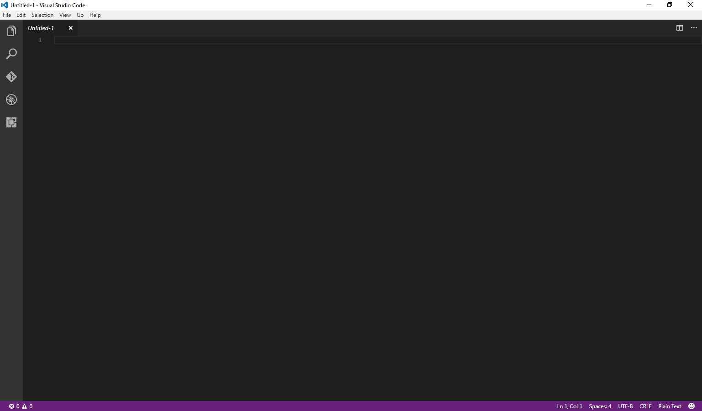

## Stap 3: Proefrit

Nu je zowel Anaconda als Visual Studio Code hebt geïnstalleerd, kunnen we gaan kijken of alles werkt. Maak als eerste stap ergens op jouw computer (bijvoorbeeld de *Desktop*) een map aan genaamd `programmeren`. Dat wordt de plek waarin we gaan werken. Maak vervolgens binnen `programmeren` een map aan genaamd `week1`. (Weet je niet zo goed hoe je mappen moet maken? Kijk eens bij [Apple](https://support.apple.com/en-us/HT201732) voor Mac OS of bij [Dummies.com](http://www.dummies.com/computers/operating-systems/windows-10/how-to-create-a-new-folder-in-windows-10/) voor Windows.)

Open nu Visual Studio Code. Zodra je dit hebt gedaan zie je het volgende scherm:

{:style="max-width:50%"}

Klik in de menubalk op **File** en kies dan:

- Windows: **Open Folder...**
- Mac: **Open...**

Kies vervolgens de `week1`-map die je hebt aangemaakt. Je ziet dan de volgende *sidebar* verschijnen. De icoontjes die naast `week1` staan verschijnen alleen als je met de muis in de sidebar staat:

{:style="max-width:50%"}

Maak via deze sidebar een nieuw bestand aan met de knop . Je kunt dan meteen de naam van het bestand ingeven. Noem het bestand `hello.py` (vergeet niet om heel precies `.py` aan het einde van de naam te zetten zodat jij en de computer herkennen dat het een Python programma is). Druk op **ENTER** om de naam te bevestigen.

Krijg je de volgende melding? Klik dan op **Don't show again**. We hebben de extra hulp niet nodig tijdens deze cursus.

## Stap 4: Een stukje code schrijven

Zet in de file `hello.py` nu de volgende regel code: 

	print "Hello, world!"

Sla het bestand `hello.py` op. En dan het moment van de waarheid: druk op de toetscombinatie **ctrl**+**\`**. Dat is dus tegelijkertijd de **ctrl** en **\`** (deze toets vind je meestal naast de 1 of naast de Z op je toetsenbord).

Dan zie je een extra onderdeel verschijnen in je Visual Studio-scherm:

{:style="max-width:80%"}

Dit onderdeel heet de **terminal** en is de plek waar we Python en jouw programma's kunnen laten uitvoeren. Het gebied met het stippellijntje in de figuur hierboven noemen we de **prompt** waar we een opdracht kunnen intikken die de computer vervolgens uit gaat voeren. De prompt ziet er wat ingewikkeld uit, maar dat kunnen we negeren.

Tip: de prompt kan er op verschillende besturingssystemen anders uitzien!

Laten we het meteen maar eens uitproberen met ons programma `hello.py`. Voer het volgende commando in achter de prompt:

	python hello.py

Druk op **ENTER** om de opdracht te starten. De computer kijkt in de file `hello.py` en ziet welke commando's hij uit moet voeren. In dit geval maar een enkele regelen die zegt dat de computer de tekst "Hello, world" op het scherm moet printen. Als het goed is doet de computer dat braaf. 

En kijk, jouw eerste (werkende) programma is een feit!

## Stap 5: Automatische check: `checkpy`

Om jou te helpen controleren of wat je programmeert ook daadwerkelijk in overeenstemming is met de opdracht, hebben wij een programma geschreven genaamd **checkpy**. Gebruik het bij de opdrachten in de cursus om te kijken of je op de goede weg bent.

Dit programma kun je installeren door in de terminal het volgende commando uit te voeren:

	pip install checkpy

Dit kan even duren, en je zult wat tekst over je scherm zien gaan. Daarna is checkpy geïnstalleerd. Behalve checkpy hebben we ook tests nodig om de opdrachten die jij zometeen gaat maken te testen. Deze tests kun je downloaden door het volgende commando in de terminal te voeren:

	checkpy -d jelleas/progbeta2017tests

Om te testen of alles werkt, en of `hello.py` klopt, voer je het volgende commando in de terminal uit:

	checkpy hello

Kleurt alles groen en zie je alleen maar vrolijke smileys? Dan zit je goed, en heb je aan onze eisen voor de opdracht voldaan! Mocht er iets rood kleuren, geen paniek! Kijk goed na of je precies hebt gedaan wat er is gevraagd, en mail gerust als je klem zit.
